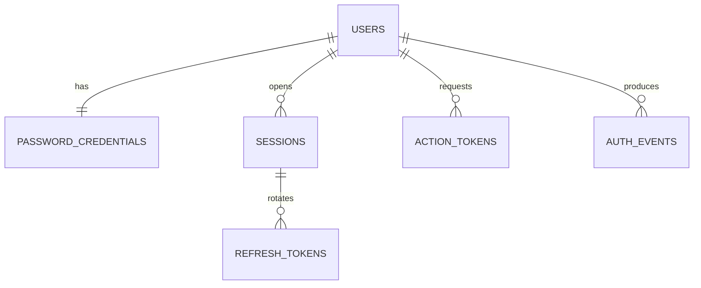
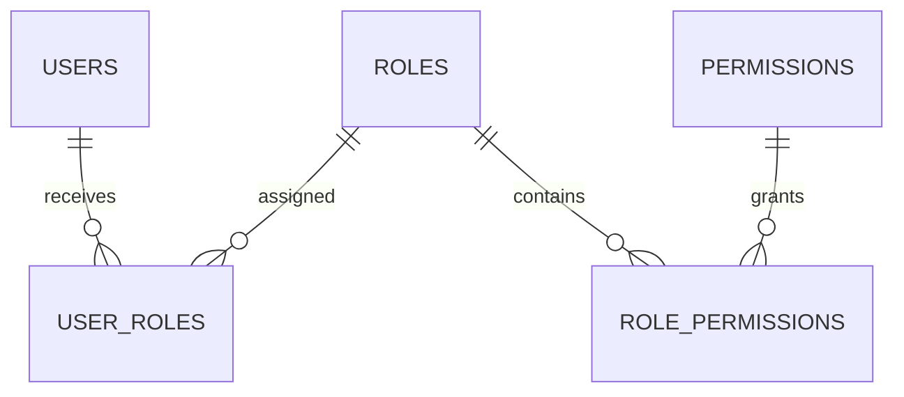

# Thiết kế hệ thống đăng nhập và phân quyền RBAC trên PostgreSQL

## 1. Mục tiêu và phạm vi

Tài liệu này đề xuất một schema **vừa đủ cho phiên bản đầu tiên** của Identity bounded context:

- đăng ký và đăng nhập bằng `username`/email + mật khẩu;
- xác minh email và quên/đặt lại mật khẩu;
- access token dạng JWT có thời gian sống ngắn;
- phiên đăng nhập và refresh token có rotation/reuse detection;
- phân quyền RBAC: user → role → permission;
- lưu vết các sự kiện xác thực quan trọng.

Không đưa social login, magic link, MFA, SAML/SSO và multi-tenant vào v1. Những tính năng này có thể bổ sung mà không phá vỡ schema cốt lõi.

> Giới hạn của việc đọc ảnh: ảnh nguồn chỉ có kích thước 167×800 px nên không thể kiểm chứng chính xác từng tên cột. Tuy nhiên, cấu trúc và các tên bảng còn nhận ra được khớp với schema Supabase Auth: `users`, `identities`, `sessions`, `refresh_tokens`, one-time token, MFA và SSO/SAML. Vì vậy tài liệu dùng sơ đồ như nguồn cảm hứng về xác thực, không sao chép nguyên schema nội bộ của Supabase.

## 2. Phân tích sơ đồ gốc

Sơ đồ gốc tập trung vào **authentication**:

- `users` là thực thể trung tâm;
- `identities` biểu diễn các cách đăng nhập của một user;
- `sessions` và `refresh_tokens` duy trì phiên;
- nhóm bảng one-time token/flow phục vụ xác minh, khôi phục hoặc OAuth flow;
- nhóm MFA quản lý factor, challenge và mức bảo đảm xác thực;
- nhóm SSO/SAML phục vụ đăng nhập doanh nghiệp;
- audit log ghi lại sự kiện bảo mật.

Đây là thiết kế hợp lý cho một Auth service đa tính năng, nhưng chưa phải mô hình phân quyền ứng dụng đầy đủ. Một cột `role` trong `users` hoặc JWT chỉ phù hợp với một vai trò đơn giản; nó không biểu diễn được quan hệ nhiều-nhiều giữa user, role và permission.

### Các bảng còn thiếu để có RBAC

| Bảng | Lý do cần |
| --- | --- |
| `roles` | Danh mục vai trò như `admin`, `staff`, `user`. |
| `permissions` | Danh mục quyền nguyên tử như `product.read`, `product.manage`. |
| `user_roles` | Một user có thể có nhiều role; một role có nhiều user. |
| `role_permissions` | Một role có nhiều permission; một permission thuộc nhiều role. |

Không thêm `user_permissions` ở v1. Cấp quyền trực tiếp cho từng user dễ tạo ngoại lệ khó kiểm soát. Nếu thật sự có nhu cầu override, nên thiết kế riêng cơ chế grant/deny và audit thay vì thêm bảng một cách tùy tiện.

### Những phần của sơ đồ không cần sao chép vào v1

| Nhóm bảng trong mô hình đầy đủ | Khi nào mới cần |
| --- | --- |
| `identities` | Khi hỗ trợ Google, Microsoft, GitHub, OIDC hoặc một user có nhiều cách đăng nhập. |
| MFA factors/challenges/claims | Khi triển khai TOTP, SMS OTP, WebAuthn/passkey. |
| SSO/SAML providers/domains/relay states | Khi có khách hàng doanh nghiệp và đăng nhập theo domain. |
| `instances` | Khi một Auth service phục vụ nhiều site/project độc lập. |
| OAuth flow state | Khi chính hệ thống đóng vai trò OAuth/OIDC client hoặc authorization server. |
| `schema_migrations` | Nên để Alembic quản lý thay vì tự thiết kế bảng nghiệp vụ. |

## 3. Thiết kế được chọn

Schema PostgreSQL: `identity`.

### Nhóm bảng v1

| Mức | Bảng | Trách nhiệm |
| --- | --- | --- |
| Bắt buộc | `users` | Định danh, trạng thái tài khoản và version vô hiệu hóa token. |
| Bắt buộc | `password_credentials` | Password hash và trạng thái khóa do đăng nhập sai. |
| Bắt buộc | `roles` | Vai trò ứng dụng. |
| Bắt buộc | `permissions` | Quyền nguyên tử. |
| Bắt buộc | `user_roles` | Gán role cho user. |
| Bắt buộc | `role_permissions` | Gán permission cho role. |
| Bắt buộc nếu dùng refresh token | `sessions` | Một phiên đăng nhập trên một thiết bị/client. |
| Bắt buộc nếu dùng refresh token | `refresh_tokens` | Chuỗi refresh token rotation; chỉ lưu hash. |
| Bắt buộc cho quy trình tài khoản | `action_tokens` | Token một lần cho xác minh email và reset mật khẩu. |
| Khuyến nghị mạnh | `auth_events` | Audit đăng nhập, refresh, logout, đổi mật khẩu và phân quyền. |

### Quan hệ đăng nhập và phiên



### Quan hệ RBAC



## 4. Quy ước kiểu dữ liệu PostgreSQL

| Loại dữ liệu | Kiểu chọn | Lý do |
| --- | --- | --- |
| ID nghiệp vụ | `uuid` | Không để lộ số lượng bản ghi, dễ tạo ở nhiều service; PostgreSQL hỗ trợ native. |
| Email/username/code không phân biệt hoa thường | `citext` | Unique và so sánh không phân biệt hoa thường. Cần extension `citext`. |
| Mốc thời gian | `timestamptz` | Lưu một thời điểm tuyệt đối; ứng dụng hiển thị theo múi giờ người dùng. |
| Password hash | `text` | Chuỗi PHC chứa thuật toán, salt và tham số; độ dài có thể thay đổi. |
| Hash token | `bytea` | Lưu 32 byte SHA-256, không lưu token gốc. |
| IP | `inet` | Kiểu native cho IPv4/IPv6. |
| Metadata audit | `jsonb` | Dữ liệu phụ linh hoạt, không dùng thay cho các cột cần constraint/query thường xuyên. |
| Trạng thái | `varchar` + `CHECK` | Dễ migration hơn PostgreSQL enum khi trạng thái thay đổi. |
| Thời điểm audit ID | `bigint GENERATED ... AS IDENTITY` | Gọn và tối ưu cho bảng ghi nối tiếp lớn. |

`citext` là locale-aware. Không tự áp dụng các quy tắc riêng của Gmail như bỏ dấu chấm hoặc dấu `+`; chỉ trim và chuẩn hóa theo chính sách email của ứng dụng.

## 5. Data dictionary

### 5.1 `identity.users`

| Cột | Kiểu | Null | Default/constraint | Ý nghĩa |
| --- | --- | --- | --- | --- |
| `id` | `uuid` | Không | PK, `gen_random_uuid()` | User ID ổn định, cũng dùng cho claim JWT `sub`. |
| `username` | `citext` | Không | UNIQUE | Tên đăng nhập không phân biệt hoa/thường. |
| `email` | `citext` | Không | UNIQUE | Email đăng nhập. |
| `display_name` | `varchar(150)` | Có |  | Tên hiển thị tối thiểu; profile chi tiết nên ở bounded context khác. |
| `status` | `varchar(16)` | Không | `pending`; CHECK | `pending`, `active`, `locked`, `disabled`. |
| `email_verified_at` | `timestamptz` | Có |  | `NULL` nghĩa là email chưa xác minh. |
| `auth_version` | `integer` | Không | `1`, `> 0` | Tăng khi đổi mật khẩu, trạng thái hoặc role; JWT mang claim `ver`. |
| `last_login_at` | `timestamptz` | Có |  | Lần đăng nhập thành công gần nhất. |
| `created_at` | `timestamptz` | Không | `now()` | Thời điểm tạo. |
| `updated_at` | `timestamptz` | Không | `now()` | Application cập nhật khi sửa. |

Không đặt `role_id` trong `users`, vì quan hệ user-role là nhiều-nhiều. Không đặt địa chỉ, avatar, ngày sinh hoặc dữ liệu shop vào bảng xác thực.

### 5.2 `identity.password_credentials`

| Cột | Kiểu | Null | Default/constraint | Ý nghĩa |
| --- | --- | --- | --- | --- |
| `user_id` | `uuid` | Không | PK, FK → `users.id`, CASCADE | Quan hệ 1-1 với user. |
| `password_hash` | `text` | Không |  | Chuỗi hash Argon2id dạng PHC; không phải mật khẩu mã hóa. |
| `password_changed_at` | `timestamptz` | Không | `now()` | Dùng cho audit/chính sách re-authentication. |
| `must_change_password` | `boolean` | Không | `false` | Ép đổi mật khẩu ở lần đăng nhập kế tiếp. |
| `failed_attempt_count` | `integer` | Không | `0`, `>= 0` | Bộ đếm sai liên tiếp theo tài khoản. |
| `locked_until` | `timestamptz` | Có |  | Khóa tạm thời; khác với `users.status='disabled'`. |
| `created_at` | `timestamptz` | Không | `now()` | Thời điểm tạo credential. |
| `updated_at` | `timestamptz` | Không | `now()` | Thời điểm sửa gần nhất. |

Không cần cột `salt`: thư viện Argon2id chuẩn tự tạo salt và đưa salt/tham số vào chuỗi PHC. Nếu dùng pepper, pepper phải ở secret manager/environment, không ở PostgreSQL.

### 5.3 `identity.roles`

| Cột | Kiểu | Null | Default/constraint | Ý nghĩa |
| --- | --- | --- | --- | --- |
| `id` | `uuid` | Không | PK | Role ID. |
| `code` | `citext` | Không | UNIQUE | Mã ổn định: `admin`, `staff`, `user`. |
| `name` | `varchar(100)` | Không |  | Tên hiển thị. |
| `description` | `text` | Có |  | Mô tả nghiệp vụ. |
| `is_system` | `boolean` | Không | `false` | Role hệ thống không được xóa qua UI thông thường. |
| `created_at` | `timestamptz` | Không | `now()` | Thời điểm tạo. |
| `updated_at` | `timestamptz` | Không | `now()` | Thời điểm sửa. |

### 5.4 `identity.permissions`

| Cột | Kiểu | Null | Default/constraint | Ý nghĩa |
| --- | --- | --- | --- | --- |
| `id` | `uuid` | Không | PK | Permission ID. |
| `code` | `citext` | Không | UNIQUE | Mã bất biến theo mẫu `resource.action`. |
| `description` | `text` | Có |  | Ý nghĩa quyền. |
| `created_at` | `timestamptz` | Không | `now()` | Thời điểm tạo. |
| `updated_at` | `timestamptz` | Không | `now()` | Thời điểm sửa. |

Ví dụ: `identity.user.read`, `identity.user.manage`, `catalog.product.read`, `catalog.product.manage`, `sales.order.read`, `sales.order.manage`, `inventory.stock.adjust`.

### 5.5 `identity.user_roles`

| Cột | Kiểu | Null | Default/constraint | Ý nghĩa |
| --- | --- | --- | --- | --- |
| `user_id` | `uuid` | Không | PK phần 1, FK → `users.id` | User được cấp role. |
| `role_id` | `uuid` | Không | PK phần 2, FK → `roles.id` | Role được cấp. |
| `assigned_at` | `timestamptz` | Không | `now()` | Thời điểm cấp. |
| `assigned_by` | `uuid` | Có | FK → `users.id`, SET NULL | Ai đã cấp; `NULL` khi bootstrap/system. |
| `expires_at` | `timestamptz` | Có |  | Role tạm thời; `NULL` là không hết hạn. |

Primary key `(user_id, role_id)` ngăn cấp trùng cùng một role. Khi thêm/xóa role, application phải tăng `users.auth_version` trong cùng transaction.

### 5.6 `identity.role_permissions`

| Cột | Kiểu | Null | Default/constraint | Ý nghĩa |
| --- | --- | --- | --- | --- |
| `role_id` | `uuid` | Không | PK phần 1, FK → `roles.id` | Role. |
| `permission_id` | `uuid` | Không | PK phần 2, FK → `permissions.id` | Permission. |
| `granted_at` | `timestamptz` | Không | `now()` | Thời điểm gán. |
| `granted_by` | `uuid` | Có | FK → `users.id`, SET NULL | Ai đã gán. |

Khi permission của role thay đổi, cache quyền phải bị xóa và `auth_version` của các user đang mang role đó phải tăng, hoặc chấp nhận quyền cũ tồn tại đến khi access token ngắn hạn hết hạn.

### 5.7 `identity.sessions`

| Cột | Kiểu | Null | Default/constraint | Ý nghĩa |
| --- | --- | --- | --- | --- |
| `id` | `uuid` | Không | PK | Session ID; đưa vào JWT claim `sid`. |
| `user_id` | `uuid` | Không | FK → `users.id`, CASCADE | Chủ phiên. |
| `created_at` | `timestamptz` | Không | `now()` | Bắt đầu phiên. |
| `last_seen_at` | `timestamptz` | Không | `now()` | Cập nhật khi refresh, không cần ở mọi API request. |
| `expires_at` | `timestamptz` | Không |  | Hạn tuyệt đối của phiên. |
| `revoked_at` | `timestamptz` | Có |  | Có giá trị nghĩa là đã logout/revoke. |
| `revoke_reason` | `varchar(50)` | Có |  | `logout`, `password_changed`, `token_reuse`, `admin_revoked`... |
| `ip_address` | `inet` | Có |  | IP lúc tạo phiên. |
| `user_agent` | `text` | Có |  | Thông tin client để hiển thị “thiết bị đang đăng nhập”. |

Không lưu access JWT trong database. JWT được kiểm tra chữ ký và thời hạn; chỉ kiểm tra `sessions` cho endpoint nhạy cảm hoặc khi cần logout có hiệu lực ngay.

### 5.8 `identity.refresh_tokens`

| Cột | Kiểu | Null | Default/constraint | Ý nghĩa |
| --- | --- | --- | --- | --- |
| `id` | `uuid` | Không | PK | ID nội bộ của refresh token. |
| `session_id` | `uuid` | Không | FK → `sessions.id`, CASCADE | Token thuộc phiên nào. |
| `token_hash` | `bytea` | Không | UNIQUE, 32 byte | SHA-256 của token ngẫu nhiên; không lưu token gốc. |
| `parent_token_id` | `uuid` | Có | FK tự tham chiếu | Token trước trong chuỗi rotation. |
| `created_at` | `timestamptz` | Không | `now()` | Thời điểm phát hành. |
| `expires_at` | `timestamptz` | Không |  | Hết hạn refresh token. |
| `used_at` | `timestamptz` | Có |  | Đã exchange; lần dùng lại là dấu hiệu replay. |
| `revoked_at` | `timestamptz` | Có |  | Bị thu hồi mà chưa cần xóa record. |

Mỗi lần refresh phải khóa row hiện tại (`SELECT ... FOR UPDATE`), đánh dấu `used_at`, tạo token con và trả raw token mới đúng một lần. Nếu một token đã dùng bị gửi lại ngoài khoảng dung sai rất ngắn, revoke toàn bộ session.

### 5.9 `identity.action_tokens`

| Cột | Kiểu | Null | Default/constraint | Ý nghĩa |
| --- | --- | --- | --- | --- |
| `id` | `uuid` | Không | PK | ID nội bộ. |
| `user_id` | `uuid` | Không | FK → `users.id`, CASCADE | Chủ token. |
| `purpose` | `varchar(24)` | Không | CHECK | `verify_email` hoặc `reset_password`. |
| `token_hash` | `bytea` | Không | UNIQUE, 32 byte | Hash của token một lần. |
| `created_at` | `timestamptz` | Không | `now()` | Thời điểm tạo. |
| `expires_at` | `timestamptz` | Không |  | Hạn sử dụng. |
| `consumed_at` | `timestamptz` | Có |  | Đã dùng; không được dùng lại. |
| `requested_ip` | `inet` | Có |  | IP yêu cầu token để audit/rate-limit. |

Khi tạo token mới cùng user + purpose, revoke hoặc tiêu thụ các token cũ chưa dùng. Response của “forgot password” phải giống nhau dù email tồn tại hay không để tránh dò tài khoản.

### 5.10 `identity.auth_events`

| Cột | Kiểu | Null | Default/constraint | Ý nghĩa |
| --- | --- | --- | --- | --- |
| `id` | `bigint` | Không | PK, identity | ID tăng dần cho audit. |
| `user_id` | `uuid` | Có | FK → `users.id`, SET NULL | Có thể chưa biết user khi login thất bại. |
| `session_id` | `uuid` | Có | FK → `sessions.id`, SET NULL | Session liên quan. |
| `event_type` | `varchar(60)` | Không |  | Ví dụ `login.succeeded`, `login.failed`, `role.assigned`. |
| `success` | `boolean` | Không |  | Kết quả. |
| `ip_address` | `inet` | Có |  | IP nguồn. |
| `user_agent` | `text` | Có |  | Client. |
| `metadata` | `jsonb` | Không | `{}` | Chi tiết không nhạy cảm, có cấu trúc. |
| `created_at` | `timestamptz` | Không | `now()` | Thời điểm sự kiện. |

Không log mật khẩu, JWT, raw refresh/action token, password hash hoặc secret.

## 6. PostgreSQL DDL đề xuất

DDL sau chạy được trên PostgreSQL hiện đại. Nên đưa nó vào Alembic migration thay vì chạy thủ công trong production.

```sql
CREATE SCHEMA IF NOT EXISTS identity;
CREATE EXTENSION IF NOT EXISTS citext;

CREATE TABLE identity.users (
    id                  uuid PRIMARY KEY DEFAULT gen_random_uuid(),
    username            citext NOT NULL,
    email               citext NOT NULL,
    display_name        varchar(150),
    status              varchar(16) NOT NULL DEFAULT 'pending',
    email_verified_at   timestamptz,
    auth_version        integer NOT NULL DEFAULT 1,
    last_login_at       timestamptz,
    created_at          timestamptz NOT NULL DEFAULT now(),
    updated_at          timestamptz NOT NULL DEFAULT now(),

    CONSTRAINT uq_users_username UNIQUE (username),
    CONSTRAINT uq_users_email UNIQUE (email),
    CONSTRAINT ck_users_status
        CHECK (status IN ('pending', 'active', 'locked', 'disabled')),
    CONSTRAINT ck_users_auth_version CHECK (auth_version > 0)
);

CREATE TABLE identity.password_credentials (
    user_id                 uuid PRIMARY KEY
                                REFERENCES identity.users(id) ON DELETE CASCADE,
    password_hash           text NOT NULL,
    password_changed_at     timestamptz NOT NULL DEFAULT now(),
    must_change_password    boolean NOT NULL DEFAULT false,
    failed_attempt_count    integer NOT NULL DEFAULT 0,
    locked_until            timestamptz,
    created_at              timestamptz NOT NULL DEFAULT now(),
    updated_at              timestamptz NOT NULL DEFAULT now(),

    CONSTRAINT ck_password_failed_attempts CHECK (failed_attempt_count >= 0)
);

CREATE TABLE identity.roles (
    id              uuid PRIMARY KEY DEFAULT gen_random_uuid(),
    code            citext NOT NULL,
    name            varchar(100) NOT NULL,
    description     text,
    is_system       boolean NOT NULL DEFAULT false,
    created_at      timestamptz NOT NULL DEFAULT now(),
    updated_at      timestamptz NOT NULL DEFAULT now(),

    CONSTRAINT uq_roles_code UNIQUE (code),
    CONSTRAINT ck_roles_code CHECK (code::text ~ '^[a-z][a-z0-9_]*$')
);

CREATE TABLE identity.permissions (
    id              uuid PRIMARY KEY DEFAULT gen_random_uuid(),
    code            citext NOT NULL,
    description     text,
    created_at      timestamptz NOT NULL DEFAULT now(),
    updated_at      timestamptz NOT NULL DEFAULT now(),

    CONSTRAINT uq_permissions_code UNIQUE (code),
    CONSTRAINT ck_permissions_code
        CHECK (code::text ~ '^[a-z][a-z0-9_.:-]*$')
);

CREATE TABLE identity.user_roles (
    user_id         uuid NOT NULL
                        REFERENCES identity.users(id) ON DELETE CASCADE,
    role_id         uuid NOT NULL
                        REFERENCES identity.roles(id) ON DELETE CASCADE,
    assigned_at     timestamptz NOT NULL DEFAULT now(),
    assigned_by     uuid
                        REFERENCES identity.users(id) ON DELETE SET NULL,
    expires_at      timestamptz,

    PRIMARY KEY (user_id, role_id),
    CONSTRAINT ck_user_roles_expiry
        CHECK (expires_at IS NULL OR expires_at > assigned_at)
);

CREATE INDEX ix_user_roles_role_id
    ON identity.user_roles (role_id);
CREATE INDEX ix_user_roles_user_expiry
    ON identity.user_roles (user_id, expires_at);

CREATE TABLE identity.role_permissions (
    role_id         uuid NOT NULL
                        REFERENCES identity.roles(id) ON DELETE CASCADE,
    permission_id   uuid NOT NULL
                        REFERENCES identity.permissions(id) ON DELETE CASCADE,
    granted_at      timestamptz NOT NULL DEFAULT now(),
    granted_by      uuid
                        REFERENCES identity.users(id) ON DELETE SET NULL,

    PRIMARY KEY (role_id, permission_id)
);

CREATE INDEX ix_role_permissions_permission_id
    ON identity.role_permissions (permission_id);

CREATE TABLE identity.sessions (
    id              uuid PRIMARY KEY DEFAULT gen_random_uuid(),
    user_id         uuid NOT NULL
                        REFERENCES identity.users(id) ON DELETE CASCADE,
    created_at      timestamptz NOT NULL DEFAULT now(),
    last_seen_at    timestamptz NOT NULL DEFAULT now(),
    expires_at      timestamptz NOT NULL,
    revoked_at      timestamptz,
    revoke_reason   varchar(50),
    ip_address      inet,
    user_agent      text,

    CONSTRAINT ck_sessions_expiry CHECK (expires_at > created_at),
    CONSTRAINT ck_sessions_revoked
        CHECK (revoked_at IS NULL OR revoked_at >= created_at)
);

CREATE INDEX ix_sessions_user_state
    ON identity.sessions (user_id, revoked_at, expires_at);

CREATE TABLE identity.refresh_tokens (
    id                  uuid PRIMARY KEY DEFAULT gen_random_uuid(),
    session_id          uuid NOT NULL
                            REFERENCES identity.sessions(id) ON DELETE CASCADE,
    token_hash          bytea NOT NULL,
    parent_token_id     uuid
                            REFERENCES identity.refresh_tokens(id) ON DELETE SET NULL,
    created_at          timestamptz NOT NULL DEFAULT now(),
    expires_at          timestamptz NOT NULL,
    used_at             timestamptz,
    revoked_at          timestamptz,

    CONSTRAINT uq_refresh_tokens_hash UNIQUE (token_hash),
    CONSTRAINT ck_refresh_token_hash_size CHECK (octet_length(token_hash) = 32),
    CONSTRAINT ck_refresh_tokens_expiry CHECK (expires_at > created_at),
    CONSTRAINT ck_refresh_tokens_used
        CHECK (used_at IS NULL OR used_at >= created_at),
    CONSTRAINT ck_refresh_tokens_revoked
        CHECK (revoked_at IS NULL OR revoked_at >= created_at)
);

CREATE INDEX ix_refresh_tokens_session
    ON identity.refresh_tokens (session_id, created_at DESC);
CREATE INDEX ix_refresh_tokens_parent
    ON identity.refresh_tokens (parent_token_id);

CREATE TABLE identity.action_tokens (
    id              uuid PRIMARY KEY DEFAULT gen_random_uuid(),
    user_id         uuid NOT NULL
                        REFERENCES identity.users(id) ON DELETE CASCADE,
    purpose         varchar(24) NOT NULL,
    token_hash      bytea NOT NULL,
    created_at      timestamptz NOT NULL DEFAULT now(),
    expires_at      timestamptz NOT NULL,
    consumed_at     timestamptz,
    requested_ip    inet,

    CONSTRAINT uq_action_tokens_hash UNIQUE (token_hash),
    CONSTRAINT ck_action_tokens_purpose
        CHECK (purpose IN ('verify_email', 'reset_password')),
    CONSTRAINT ck_action_token_hash_size CHECK (octet_length(token_hash) = 32),
    CONSTRAINT ck_action_tokens_expiry CHECK (expires_at > created_at),
    CONSTRAINT ck_action_tokens_consumed
        CHECK (consumed_at IS NULL OR consumed_at >= created_at)
);

CREATE INDEX ix_action_tokens_user_purpose
    ON identity.action_tokens (user_id, purpose, created_at DESC);

CREATE TABLE identity.auth_events (
    id              bigint GENERATED ALWAYS AS IDENTITY PRIMARY KEY,
    user_id         uuid
                        REFERENCES identity.users(id) ON DELETE SET NULL,
    session_id      uuid
                        REFERENCES identity.sessions(id) ON DELETE SET NULL,
    event_type      varchar(60) NOT NULL,
    success         boolean NOT NULL,
    ip_address      inet,
    user_agent      text,
    metadata        jsonb NOT NULL DEFAULT '{}'::jsonb,
    created_at      timestamptz NOT NULL DEFAULT now()
);

CREATE INDEX ix_auth_events_user_time
    ON identity.auth_events (user_id, created_at DESC);
CREATE INDEX ix_auth_events_type_time
    ON identity.auth_events (event_type, created_at DESC);
```

`updated_at` không tự đổi chỉ vì có default. Application service/SQLAlchemy phải set `updated_at=now()` trong cùng transaction, hoặc thêm một trigger chung nếu muốn DB thực thi quy tắc này.

## 7. Seed role và permission ban đầu

Không tạo tài khoản admin với mật khẩu mặc định trong SQL. Hãy tạo admin qua một CLI/bootstrap command của application để mật khẩu được hash đúng cách và secret không đi vào migration/history.

Role tối thiểu:

- `admin`: quản trị toàn hệ thống;
- `user`: người dùng thông thường;
- chỉ thêm `staff` khi nghiệp vụ shop thực sự phân biệt nhân viên và khách hàng.

Permission nên là hành động nghiệp vụ, không phải URL hoặc tên nút UI:

```text
identity.user.read
identity.user.manage
identity.role.manage
catalog.product.read
catalog.product.manage
sales.order.read
sales.order.manage
inventory.stock.read
inventory.stock.adjust
```

RBAC chỉ trả lời **có được thực hiện loại hành động này hay không**. Quy tắc ownership trả lời **được thực hiện trên bản ghi nào**. Ví dụ user có `sales.order.read` vẫn chỉ được đọc order có `customer_id = principal.user_id`; admin có thể đọc tất cả. Ownership nên nằm trong domain policy/query filter, không tạo hàng nghìn permission theo từng record.

## 8. Luồng xác thực

### 8.1 Đăng ký

1. Chuẩn hóa `username` và email; kiểm tra unique.
2. Hash mật khẩu bằng Argon2id trong application/infrastructure service.
3. Trong một transaction: tạo `users(status='pending')`, `password_credentials`, role mặc định `user`, và `action_tokens(purpose='verify_email')`.
4. Commit rồi gửi email bằng outbox/background job. Không giữ database transaction trong lúc gọi SMTP.
5. Khi token xác minh hợp lệ: set `email_verified_at`, chuyển status thành `active`, đánh dấu `consumed_at`.

### 8.2 Đăng nhập

1. Rate-limit theo IP và login identifier; có thể dùng Redis cho cửa sổ thời gian ngắn.
2. Tìm user + credential bằng username hoặc email. Nếu không tìm thấy vẫn chạy một dummy Argon2 verification để giảm chênh lệch thời gian.
3. Kiểm tra `status`, `locked_until` và email verification theo chính sách.
4. Verify password hash. Sai thì tăng bộ đếm bằng update nguyên tử; đúng thì reset bộ đếm.
5. Trong một transaction: cập nhật `last_login_at`, tạo `sessions`, tạo raw refresh token ngẫu nhiên tối thiểu 256 bit, lưu SHA-256 vào `refresh_tokens`.
6. Phát access JWT và trả raw refresh token đúng một lần.

Thời hạn khởi điểm hợp lý cho ứng dụng shop:

- access JWT: 10–15 phút;
- session/refresh token: 30 ngày;
- reset password token: 15 phút;
- verify email token: 24 giờ.

Đây là giá trị cấu hình, không hard-code trong domain entity.

### 8.3 JWT và request context

Claims tối thiểu:

| Claim | Giá trị |
| --- | --- |
| `iss` | Issuer của Auth service. |
| `aud` | API/service được phép nhận token. |
| `sub` | `users.id`. |
| `sid` | `sessions.id`. |
| `ver` | `users.auth_version`. |
| `iat`, `nbf`, `exp` | Thời điểm phát hành, bắt đầu hiệu lực và hết hạn. |
| `jti` | UUID riêng của access token. |
| `roles` | Danh sách role code nếu nhỏ và ổn định. |

Không nhất thiết nhét toàn bộ permission vào JWT vì token có thể phình to và quyền cũ tồn tại đến khi token hết hạn. Có thể cache tập permission theo key `user_id:auth_version`; thay đổi role/permission sẽ tăng version và xóa cache.

Trong FastAPI, nên dùng dependency như `get_current_principal()` và `require_permissions(...)` thay vì để domain service đọc trực tiếp từ `Request` hoặc JWT. Dependency tạo một `CurrentPrincipal` bất biến gồm `user_id`, `session_id`, `roles`, `permissions`; application service nhận object này qua tham số. Middleware chỉ thích hợp cho correlation ID/logging hoặc bước xác thực dùng chung thật sự ở mọi route.

### 8.4 Refresh token rotation

Trong một transaction:

1. Hash raw refresh token nhận từ client.
2. `SELECT` token theo hash `FOR UPDATE`.
3. Từ chối nếu session/token bị revoke hoặc đã hết hạn.
4. Nếu `used_at IS NOT NULL`, coi là reuse/replay và revoke toàn session.
5. Set `used_at=now()`, tạo token con với `parent_token_id` là token hiện tại.
6. Cập nhật `sessions.last_seen_at`, phát access JWT + raw refresh token mới rồi commit.

### 8.5 Logout và thay đổi bảo mật

- Logout thiết bị hiện tại: set `sessions.revoked_at` và revoke token chưa dùng của session.
- Logout tất cả thiết bị: revoke mọi session của user và tăng `auth_version`.
- Đổi/reset mật khẩu: tăng `auth_version`, revoke mọi session khác; tùy UX có thể tạo session mới cho thiết bị vừa đổi mật khẩu.
- Disable user hoặc thay đổi role quan trọng: tăng `auth_version`; endpoint nhạy cảm phải so claim `ver` với DB/cache.

## 9. Truy vấn quyền hiệu lực

```sql
SELECT DISTINCT p.code
FROM identity.user_roles AS ur
JOIN identity.roles AS r
  ON r.id = ur.role_id
JOIN identity.role_permissions AS rp
  ON rp.role_id = r.id
JOIN identity.permissions AS p
  ON p.id = rp.permission_id
WHERE ur.user_id = :user_id
  AND (ur.expires_at IS NULL OR ur.expires_at > now());
```

Không ghép chuỗi SQL từ tên permission; luôn truyền parameter qua SQLAlchemy/driver.

## 10. Mapping với DDD và Onion Architecture

| Layer | Thành phần |
| --- | --- |
| Domain | `User`, `Role`, `Permission`, policy/Specification, value object `UserId`, `PermissionCode`; không import FastAPI/SQLAlchemy/JWT. |
| Application | Use cases: `RegisterUser`, `Login`, `RefreshSession`, `Logout`, `AssignRole`, `RevokeRole`, `ChangePassword`; repository/UoW ports. |
| Infrastructure | SQLAlchemy mappings/repositories, PostgreSQL UoW, Argon2id hasher, JWT signer/verifier, Redis rate-limit/cache, email adapter. |
| Presentation | FastAPI request/response models, routes, dependencies `get_current_principal` và `require_permissions`. |

Repository hợp lý:

- `UserRepository`: user, credential và trạng thái aggregate;
- `RoleRepository`: role/permission assignments;
- `SessionRepository`: session + refresh token rotation;
- `ActionTokenRepository`: token một lần;
- audit event có thể ghi qua cùng UoW hoặc outbox tùy yêu cầu độ tin cậy.

Không để domain entity biết `password_hash` được tạo bằng thư viện nào. Domain gọi port `PasswordHasher`; infrastructure triển khai Argon2id. Tương tự, domain không tự encode JWT.

## 11. PostgreSQL container

Pin một major version được hỗ trợ thay vì dùng `latest`. Ví dụ:

```yaml
services:
  postgres:
    image: postgres:17-alpine
    environment:
      POSTGRES_DB: shop
      POSTGRES_USER: shop_app
      POSTGRES_PASSWORD: ${POSTGRES_PASSWORD}
    ports:
      - "5432:5432"
    volumes:
      - postgres_data:/var/lib/postgresql/data
    healthcheck:
      test: ["CMD-SHELL", "pg_isready -U shop_app -d shop"]
      interval: 5s
      timeout: 5s
      retries: 10

volumes:
  postgres_data:
```

Không commit `.env`. Trong production không public port `5432`; chỉ cho API kết nối qua private network. Tách database migration role khỏi runtime role nếu có thể, và không cấp `SUPERUSER`/quyền sở hữu toàn database cho tài khoản runtime.

Các bảng nghiệp vụ chỉ nên tham chiếu `identity.users(id)` bằng UUID. PostgreSQL database role (`shop_app`, `migration_user`) khác hoàn toàn application role (`admin`, `user`).

## 12. Các bảng mở rộng khi có yêu cầu thật

| Tính năng | Bảng cần thêm/thay đổi |
| --- | --- |
| Social/OIDC login | `external_identities(user_id, provider, provider_subject, identity_data, ...)`; UNIQUE `(provider, provider_subject)`. |
| MFA TOTP/WebAuthn | `mfa_factors`, `mfa_challenges`; mã hóa secret/factor material bằng key ngoài DB. |
| Multi-tenant | `tenants`, `memberships`; role assignment phải có `tenant_id`, ví dụ PK `(tenant_id, user_id, role_id)`. |
| API key/service account | `service_accounts`, `api_keys`; chỉ lưu hash key, scope và expiry. Không giả làm password user. |
| Permission override | Bảng grant/deny có scope và audit; chỉ thêm khi role không biểu diễn được yêu cầu. |
| Outbox | `outbox_messages` để gửi email/event sau commit một cách tin cậy. |

Nếu ứng dụng chắc chắn chỉ có email/password, không cần tạo `external_identities`. Nếu chưa có tenant, tuyệt đối không thêm `tenant_id` “để dành”, vì nó làm mọi unique key, query và authorization policy phức tạp hơn ngay từ đầu.

## 13. Checklist triển khai

- [ ] Dùng Alembic tạo schema/constraint/index và seed role/permission.
- [ ] Dùng Argon2id; không tự hash bằng SHA-256/bcrypt mới nếu không có lý do tương thích.
- [ ] Chỉ lưu hash của refresh/action token; raw token không vào DB/log.
- [ ] Refresh token rotation được xử lý trong transaction có row lock.
- [ ] Access JWT kiểm tra signature, algorithm allow-list, `iss`, `aud`, `exp`, `nbf`.
- [ ] Rate-limit theo IP + identifier và tránh response làm lộ user có tồn tại.
- [ ] Thay đổi password/status/role làm tăng `auth_version` và invalidates cache.
- [ ] Authorization dùng permission code; ownership được kiểm tra riêng.
- [ ] Audit event không chứa secret/PII không cần thiết.
- [ ] Có integration test cho login sai, account lock, token expiry, refresh reuse, logout, role hết hạn và quyền bị thu hồi.
- [ ] Có backup/restore test cho PostgreSQL volume.

## 14. Nguồn tham khảo

- [Supabase Auth overview](https://supabase.com/docs/guides/auth): phân biệt authentication/authorization và mô hình Auth trên PostgreSQL.
- [Supabase Users](https://supabase.com/docs/guides/auth/users): user có thể có nhiều identity và nhiều phương thức đăng nhập.
- [Supabase User sessions](https://supabase.com/docs/guides/auth/sessions): session, JWT, refresh token rotation và reuse detection.
- [Supabase Auth initial schema](https://github.com/supabase/auth/blob/master/migrations/00_init_auth_schema.up.sql): schema `users`, `refresh_tokens`, `instances`, audit log.
- [Supabase Auth RLS migration](https://github.com/supabase/auth/blob/master/migrations/20240612123726_enable_rls_update_grants.up.sql): danh sách các bảng Auth mở rộng gồm MFA, SSO/SAML, identities và one-time token.
- [OWASP Password Storage Cheat Sheet](https://cheatsheetseries.owasp.org/cheatsheets/Password_Storage_Cheat_Sheet.html): Argon2id, salt, pepper và nâng cấp work factor.
- [RFC 9700 — OAuth 2.0 Security Best Current Practice](https://www.rfc-editor.org/rfc/rfc9700.html): refresh token rotation và phát hiện token bị replay.
- [PostgreSQL UUID](https://www.postgresql.org/docs/current/datatype-uuid.html), [date/time](https://www.postgresql.org/docs/current/datatype-datetime.html), [citext](https://www.postgresql.org/docs/current/citext.html): các kiểu dữ liệu được dùng trong thiết kế.

